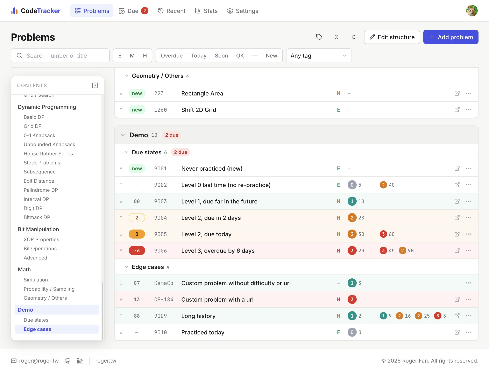
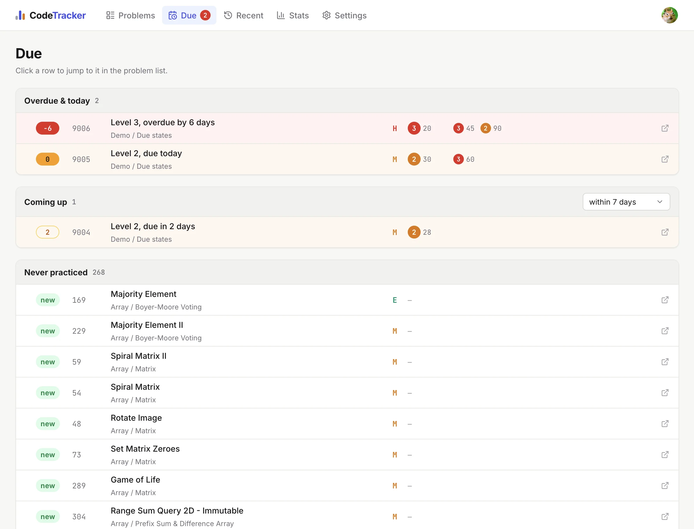

# Code Tracker

A personal spaced re-practice tracker for LeetCode. It remembers every problem you have worked on, how familiar each attempt felt, and tells you which ones are due for another round.

**Live**: [code.roger.tw](https://code.roger.tw)



## Why

"Solved" is a poor signal. What matters for interview prep is *how it felt* and *when to come back*. Code Tracker replaces a checklist with a familiarity level per attempt (0 = trivial … 3 = very hard) and turns that into a due date using intervals you choose per level (default 0 / 90 / 30 / 14 days). The list then reads like a schedule instead of a backlog.

## Features

- **Problem tree** — Main / Sub categories, fully editable inline (rename, reorder, add, delete); drag rows to reorder or move them between sub categories.
- **Rich rows** — days until re-practice, number, title + tags, difficulty, last attempt (level + days ago), the older history as chips; hover for dates and notes; faint row tint by last level.
- **One-click logging** — click a row, pick a level, optional note; edit or delete past records.
- **LeetCode autofill** — type the number, fetch title / difficulty / URL / topic tags. Custom problems (any source, any numbering, optional difficulty) live alongside.
- **Due / Recent / Stats** — overdue & today, coming up within *N* days, never practiced; a practice log grouped by day; counts by difficulty and level plus a 12-week activity chart. Rows link back to the exact row in the main list.
- **Navigation for long lists** — search, difficulty / status / tag filters, collapsible sections remembered per browser, a resizable table of contents with vim-style `scrolloff` that follows your scroll position.
- **Settings** — re-practice intervals, the "soon" window, tag colours.
- **Seeds** — a 267-problem reference list organised into 17 categories, and a demo set that exercises every due state.



## Engineering notes

- **Single sign-on without a login page.** The app never authenticates anyone. The main site issues its Auth.js session JWT on a shared cookie domain; this app shares the secret and simply *decodes* the cookie (`src/auth.ts`). No user table, no OAuth client, no password handling — and a per-account permission flag carried in the token, checked on every page and API route. Everything is scoped to the JWT's subject.
- **Calendar dates, computed where the user is.** The server stores plain `DATE`s; "today", days-since and due-in are pure functions in the browser (`src/lib/due.ts`, unit-tested), so a Taipei practice logged from Tokyo still counts on the right day.
- **One fetch, derived views.** The tracker loads one bootstrap payload; tree, due list, recent log, stats and filters are memoised selectors on the client. Mutations hit small REST routes (zod-validated, ownership-checked, unique-number conflicts → 409) then refetch; drag-and-drop is optimistic and rolls back on failure.
- **Multi-container drag-and-drop** with dnd-kit: one context over the whole tree, each sub category a sortable container, cross-container drops re-parent the row and persist as a single reorder call.
- **Sticky layout that stays put.** The toolbar owns its top gap, sub-category headers stick under it, the table of contents is a fixed panel that shrinks above the footer instead of covering it, and category cards use `overflow: clip` (not `hidden`) so they never become scroll containers for the sticky headers.
- **Design system in CSS custom properties** (`src/styles/tokens.css`): level ramp, due-urgency colours, tag palette, spacing; SCSS modules per component, Radix primitives for dialogs / menus / selects / tooltips, no utility framework.
- **Production image** is a Next.js standalone build on `node:22-alpine` that runs `prisma migrate deploy` on boot; the dev container bind-mounts the source for hot reload.
- **SEO** for the public landing only: metadata, generated Open Graph image, robots / sitemap / manifest, JSON-LD; every tracker route is `noindex`.

## Stack

| Layer | |
|---|---|
| Framework | Next.js 16 (App Router, standalone output), React 19, TypeScript |
| UI | SCSS modules, Radix UI, dnd-kit, lucide-react, sonner |
| Data | PostgreSQL 15, Prisma 6, zod |
| Auth | NextAuth v5 (decode-only, shared JWT cookie) |
| Tooling | pnpm, ESLint, Stylelint, Vitest, Docker Compose |

## Structure

```
src/
├── app/            # / landing · (app)/problems|due|recent|stats|settings · api/*
├── components/
│   ├── tracker/    # provider, tree + drag-and-drop, rows, dialogs, views, TOC
│   ├── ui/         # Radix wrappers styled with SCSS modules
│   ├── layout/     # app shell, footer, wordmark
│   └── landing/
├── lib/            # session gate, API helpers, due math, selectors, validation, LeetCode lookup
├── styles/         # tokens, reset, mixins
└── types/
prisma/             # schema + migrations
data/               # reference problem list (seed)
scripts/            # seed-reference.ts, seed-demo.ts
```

## Running it

The app is built to sit next to an existing site that issues Auth.js JWT sessions on a shared cookie domain, so it is not turnkey on its own. What it needs:

```bash
cp .env.example .env      # AUTH_SECRET + AUTH_COOKIE_NAME must match the issuing site
docker compose -f docker-compose.dev.yml up -d
pnpm seed:reference --user <user id from the issuing site>
pnpm seed:demo --user <user id>
pnpm lint && pnpm test
```

Production: `docker compose up -d --build` (migrations run on start). Server-specific setup (reverse proxy, DNS, certificates, runbook) is kept in a private ops repository.

## Author

**Roger Fan** — [roger.tw](https://roger.tw) · [GitHub](https://github.com/rogerfan48) · [LinkedIn](https://linkedin.com/in/rogerfan48)

Source is published for reference; see [LICENSE](LICENSE).
